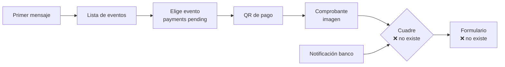

# Traspaso

Escrito el **2026-09-29** para retomar el trabajo en una conversación nueva.

| Querés… | Leé |
|---|---|
| El estado, los pendientes y las trampas | **este archivo** |
| Cómo funciona el flujo | `README.md` |
| Las tablas, campo por campo | `api/docs/modelo-de-datos.md` |

> **Nada está commiteado.** Los tres repos tienen cambios sin commitear (ver
> [Estado del código](#estado-del-código)). Si vas a empezar de cero, commiteá
> primero.

---

## Cómo arrancar

```sh
cd ops
make help            # todos los comandos con su descripción
make up              # dev-api + dev-ui + dev-worker  ⚠️ corre db:seed SIEMPRE
make api-test        # 39 pass, 0 fail
make api-types-check # tipos de Swagger al día (NO es un typecheck, ver P2)
```

| Qué | Dónde |
|---|---|
| UI (Astro) | http://localhost:4321 |
| API | http://localhost:4000 |
| Swagger | http://localhost:4000/swagger |

---

## El flujo, en orden

El bot es la única entrada. No hay página pública de torneo.

| # | Qué pasa | Dónde vive | Estado |
|---|---|---|---|
| 1 | Primer mensaje de cualquiera → se registra el contacto y recibe la **lista de eventos** | `lib/whatsapp/dispatcher.ts`, `lib/users.ts` (`touchContact`), `lib/whatsapp/entry.ts` (`eventsListMessage`) | ✅ |
| 2 | Elige un evento → se crea la **intención de pago** (`pending`, precio congelado) y recibe marketing + flyer + **QR de pago** | `lib/payments.ts` (`startPayment`), `entry.ts` (`paymentMessages`) | ✅ |
| 3 | Manda el **comprobante** (imagen) → el worker la baja de Meta, verifica el sha256, la guarda en `data/receipts/` y la cuelga del pago | `dispatcher.ts` → `queue.ts` → `workers/whatsapp-worker.ts` → `lib/receipts.ts` | ✅ |
| 4 | Llega la **notificación del banco** (app Android) → se guarda clasificada (`payment`/`other`/`unparsed`) | `routes/push-notification.ts`, `lib/bank-notifications/parse.ts` | ✅ |
| 5 | **Cuadre**: comprobante + notificación → el pago pasa a `confirmed` y sale el formulario de registro | — | ❌ **tarea 9** |
| 6 | El jugador completa el formulario → se crea `players` + `inscriptions` | — | ❌ **tareas 10-12** |

**El admin va por otro camino**: escribe `crear-evento` en el chat → el bot le
manda un link con token (60 min) → `/new-event` → el POST crea el evento y
aparece en la lista de los jugadores.



### Dónde está cada pieza

| Pieza | Archivo |
|---|---|
| Router de mensajes entrantes | `api/src/lib/whatsapp/dispatcher.ts` |
| Contactos (`users`) | `api/src/lib/users.ts` |
| Lista de eventos y mensajes del pago | `api/src/lib/whatsapp/entry.ts` |
| Pagos | `api/src/lib/payments.ts` |
| Comprobantes (bajar, verificar, guardar) | `api/src/lib/receipts.ts` + `sender.ts` (`downloadMedia`) |
| Notificaciones del banco | `api/src/lib/bank-notifications/` |
| Admin por chat (menú, alta, inscriptos) | `api/src/lib/whatsapp/admin.ts` |
| Envío a Meta | `api/src/lib/whatsapp/sender.ts` |
| Cola de trabajos | `api/src/lib/whatsapp/queue.ts` |
| Worker | `api/src/workers/whatsapp-worker.ts` |
| Tokens firmados | `api/src/lib/whatsapp/tokens.ts` |
| Formulario de alta | `ui-astro/src/pages/new-event.astro` + `api/src/routes/new-event.ts` |

---

## Estado del código

**Sin commitear** (54 archivos entre los tres repos).

### `api` — 40 archivos

Reescrito en esta etapa: `db/schema.ts` (modelo nuevo), `db/seed.ts`,
`app.ts`, `routes/auth.ts`, `routes/token.ts`, `routes/webhook-meta.ts`,
`routes/push-notification.ts`, todo `lib/whatsapp/`, `workers/whatsapp-worker.ts`.

**Nuevos:** `docs/modelo-de-datos.md`, `drizzle/0000_polite_tusk.sql` (migración
regenerada), `lib/{payments,receipts,storage-config,users}.ts`,
`lib/bank-notifications/`, `lib/whatsapp/{admin,entry,format}.ts`,
`routes/new-event.ts`, `tests/payer-name.test.ts`.

**Borrados:** `lib/auth.ts`, `lib/csrf.ts`, `lib/whatsapp/entry-cta.ts`,
`routes/users.ts`, `routes/tournaments.ts`, `scripts/dev-generate-url.ts`,
`drizzle/0000_flowery_tenebrous.sql`.

### `ui-astro` — 8 archivos

**Nuevo:** `pages/new-event.astro`.
**Borrados:** `pages/checkout.astro`, `pages/tournament.astro`.
**Modificados:** `lib/token-expired.ts`, `pages/{expired,register,verificar-lichess}.astro`,
`api/generated/schema.ts` (regenerado).

### `ops` — 6 archivos

`docker-compose.yml` y `docker-compose.prod.yml` (el worker ahora monta el
volumen de datos y recibe `SQLITE_PATH`), `Makefile` (se fue `generate-url`),
`.env.development.example`, `HANDOFF.md`, `README.md`.

---

## Hecho y verificado — no rehacer

- **Modelo de datos nuevo.** `users` (contactos) partido de `players`;
  `tournaments` → `events`; `payments` (con las columnas `receipt*` y la
  intención `pending`); `bank_notifications`; `inscriptions`. `sessions` borrada.
  Documentado campo por campo en `api/docs/modelo-de-datos.md`.
- **La intención de pago se crea al elegir el evento**, con el precio congelado
  (si el organizador cambia el precio después, lo acordado no se mueve).
- **El comprobante se baja, se verifica y se guarda.** El sha256 lo manda Meta
  en el webhook: si no coincide con lo bajado, el job reintenta y **no escribe
  nada**. Verificado con un servidor de prueba haciendo de Meta (3 intentos,
  muere, `receipt_path` sigue null).
- **La ingesta de Android es idempotente** (`notification_id` único). El parser
  distingue `payment` de `other` por el **verbo** (`te envió`/`te abonó`), no por
  el paquete, porque el mismo paquete manda marketing con montos. Verificado
  replicando las 15 notificaciones reales: 11 filas, 0 duplicados.
- **La regla del nombre para el cuadre** está escrita y probada:
  `lib/bank-notifications/payer-name.ts` (primer nombre + inicial del segundo) +
  `tests/payer-name.test.ts`. Documenta la limitación: "MEDRANO MARIO" no calza.
- **El admin por chat**: menú con botones, `crear-evento`, `lista-eventos`,
  `inscriptos`. Exige payload con firma verificada.
- **`/new-event`**: GET valida el token, POST crea el evento. El token se reclama
  atómicamente (SET NX) y **se devuelve si la validación falla**, así un
  formulario rechazado no quema el link. Verificado: 400 → el link sigue vivo;
  201 → el siguiente intento da 410.
- **Suite en verde:** 39 pass, 0 fail (`make api-test`).

---

## Pendientes, por prioridad

### P0 — el bloqueo y lo que sigue

1. **Tarea 7: extracción con IA del comprobante** → columnas `receiptAi*`.
   **Necesita proveedor + API key.** Es lo que desbloquea la 9. **No inventes un
   proveedor: preguntá.**
2. **Tarea 9: el motor de cuadre.** La regla del nombre ya está decidida y
   probada; falta la ventana temporal y juntar las dos puntas. Ojo: la
   notificación puede llegar **antes** que el comprobante, así que el cuadre
   corre en los dos momentos y **el que llega segundo completa el par**.
3. **Tareas 10-12 (registro):** token con `paymentId`, endpoint que crea
   `inscriptions`, y Lichess por jugador (`playerId` ya viaja en el token).
4. **Tarea 14:** mensaje final de confirmación.
5. **Mantener este archivo al día** — es el que lee el próximo chat.

> Para la 12: `MIN_RATED_GAMES = 100` en `api/src/lib/lichess-oauth.ts:18`
> bloquea cuentas nuevas de Lichess. Bajalo temporalmente para probar el OAuth
> feliz y devolvelo. Sigue sin verificarse de punta a punta.

> ⚠️ **Antes de probar el pago de punta a punta:** los eventos del seed tienen
> `flyerUrl` y `paymentQrUrl` en **null a propósito** (`seed.ts:146`), así que hoy
> el paso 2 manda el marketing y el instructivo pero **ningún QR**, y deja un
> `warn` en el log del worker. Para ver el paso completo hay que cargar las dos
> URLs desde `/new-event` (el formulario las pide).
>
> **No hay upload:** son URLs. El worker **las baja y las sube a Meta**, así que
> la imagen no necesita ser pública, pero sí alcanzable desde el contenedor del
> worker. Decidir dónde los va a alojar el organizador es una tarea abierta.

### P1 — seguridad (encontrado al analizar la app Android)

- **La API key está hardcodeada en el APK** (`bridger_4aad31f8…`) y ahora
  autoriza la ingesta que después confirma pagos. Rotarla no alcanza: hay que
  sacarla del APK.
- **`api/notifications.txt` sigue trackeado en git** y **ya está publicado** en
  GitHub desde el commit `90edaaa` (nombres y montos reales de terceros). Está en
  `.gitignore:41`, pero eso no destrackea. Ojo: `git rm --cached` **no lo borra**,
  porque el historial ya lo tiene — las opciones reales son reescribir el
  historial o aceptar que está público. Decisión del dueño, no del agente.
- La app apunta a `192.168.1.42` y esta máquina es `192.168.1.23`;
  `network_security_config.xml` solo permite cleartext a `.9` y `.42`.
- **La firma del webhook sigue siendo opcional** (`routes/webhook-meta.ts`).
  Las acciones de admin exigen payload verificado; el resto no. Fue una decisión
  explícita de no forzarla todavía — si querés, es una línea.

### P2 — la causa raíz de que las cosas se escondan

- **No hay typecheck.** `typescript` no está en `api/package.json`, no hay
  script, y `tsconfig.json` usa `moduleResolution: "node"`. Bun transpila sin
  chequear tipos, así que un error de tipos no aparece hasta runtime.
  **`make api-types-check` no es un typecheck**: solo verifica que los tipos
  generados desde Swagger estén al día. Arreglar esto es lo que evita que los
  pendientes de P3 se escondan.
- **Código muerto:** `api/src/lib/pagination.ts` (sin consumidores) y
  `UserSummary` en `api/src/lib/schemas.ts:93` (0 usos). Verificado.

### P3 — detalles

- `ui-astro/src/pages/register.astro` muestra el JSON crudo en un 409 y usa
  `innerHTML`.
- `/expired` está fuera del `PageShell` (no tiene header). Es a propósito para
  una pantalla completa, pero rompe la consistencia del resto. Decidir.
- `deriveRedirectUri` ignora un `LICHESS_REDIRECT_URI` configurado, y las rutas
  de Lichess no tienen rate limit.
- `CSRF_SECRET` se exige en `lib/config.ts` y solo se loguea en `index.ts:13`:
  el CSRF se eliminó, así que hoy no firma nada. Decidir si se mantiene.

---

## Trampas que hacen perder tiempo

1. **El worker manda WhatsApp DE VERDAD.** Si está arriba, postear al webhook
   envía mensajes reales a números reales. Para inspeccionar sin enviar:

   ```sh
   docker compose --env-file .env.development stop dev-worker
   # …postear al webhook, leer la cola…
   docker compose --env-file .env.development start dev-worker
   ```

   Y para correr un worker de un solo uso con otro `WHATSAPP_API_URL` (por
   ejemplo contra un servidor de prueba), **no uses `exec` en un contenedor
   parado**: usá `docker compose run --rm -T -e VAR=… dev-worker sh -c "…"`.

2. **Cómo leer la cola de Redis** (esto ya costó tres intentos en una sesión):

   Cada línea de `LRANGE` es **un documento JSON completo**, no un array. Si le
   aplicás `.[]`, `jq` itera los *valores del job* (el teléfono, el array de
   mensajes), no los jobs.

   ```sh
   # ✅ el trigger de cada job en la cola
   docker compose --env-file .env.development exec -T redis \
     redis-cli LRANGE whatsapp:queue 0 -1 | jq -r '.trigger'

   # ✅ si preferís tratarlos como array
   ... | jq -s -r '.[] | .trigger'

   # ❌ NO: Cannot index string with string "trigger"
   ... | jq -r '.[] | .trigger'
   ```

3. **`make up` corre `db:seed` siempre → borra los datos locales.** Para
   levantar sin perder nada: `docker compose --env-file .env.development up -d`.
   (`bank_notifications` **sobrevive** a propósito: la evidencia no se borra con
   el pago. El seed no las toca; si querés limpiarlas, borralas a mano.)

4. **El worker escribe en la base: necesita el volumen de datos y `SQLITE_PATH`.**
   Está en los dos composes (dev y prod). Si le agregás un import que toque la
   base, revisá que los dos lo tengan. **Sin esto abre OTRO `data/app.db`** (el
   del bind mount, no el del volumen) y lo que escribe no lo ve el api: pasó,
   es silencioso, y costó encontrarlo. La SQLite es **una sola, compartida**
   entre api y worker (WAL).

5. **El sitio es estático.** El frontmatter **no ve el query string**:
   `Astro.url.searchParams` vuelve vacío aunque en dev parezca andar (por eso
   `/expired?caso=…` se resuelve en el navegador). Cualquier cosa por request va
   del lado del cliente.

6. **macOS de esta máquina:** no hay `timeout` (usá un tope de espera propio), y
   Chrome headless necesita `--headless=new` — con el modo viejo se cuelga. Para
   capturar sin quedarte esperando: lanzalo con `&`, hacé polling del archivo, y
   matalo.

7. **El puerto 4321 colisiona** con un `astro dev` corriendo en el host.

8. **`make api-test` corre dentro del contenedor** y arma la base de test leyendo
   `api/drizzle/`. Si no hay migraciones, tira un error explícito.

9. **`make verify` NO corre los tests**: hace `db-rebuild` + tipos + `smoke-test`.
   Corré `make api-test` aparte.

---

## Datos del seed

**Eventos** (4):

| slug | nombre | modalidad | precio | activo |
|---|---|---|---|---|
| `evento-copa-paz` | Copa La Paz - Julio 2026 | presencial | 7 Bs | sí |
| `cosmic-fisher` | Arena Online Peón Veloz | **online** | 10 Bs | sí |
| `evento-intercolegial` | Intercolegial La Paz 2026 | presencial | 5 Bs | sí |
| `evento-relampago` | Torneo Relámpago Club Bolívar | presencial | 3 Bs | no |

**Teléfonos:** `59173505230` (el organizador real, rol `admin`), `77777777`
(Admin PeonVeloz, `admin`), `780000000` / `780000001` (jugadores con y sin cuenta
de Lichess). Para probar la entrada del flujo sirve **cualquier número
desconocido**: se crea el contacto y recibe la lista.

⚠️ Los datos del seed están **inconsistentes a propósito** (el nombre dice "Copa
La Paz - Julio 2026" con fecha de octubre, el `marketingText` menciona otra
cosa). Es un fixture, no un evento real.
